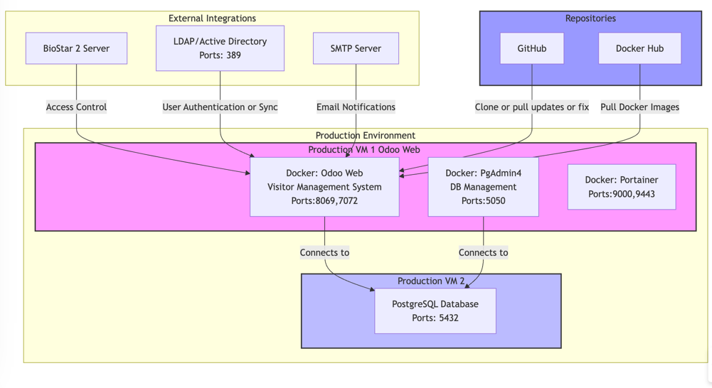

# Odoo Installation Notes
## Deployment Diagram

### Installation Checklist
#### 1. Install PostgreSQL in Virtual Machine
- [ ] Update the system
- [ ] Install PostgreSQL 15

#### 2. Install Odoo in Virtual Machine
- [ ] Clone `addons_ams` (branch 18.0)
- [ ] Clone `addons_thp` (branch 18.0)
- [ ] Install Docker
- [ ] Install Odoo via Docker
- [ ] Install Portainer-ce
- [ ] Install PgAdmin4
- [ ] Install Nginx Proxy Manager (NPM)

## Installation Steps Guidelines

### 1. Install PostgreSQL in Virtual Machine
- **References**
  - Ubuntu: [02_1_postgres_installation_ubuntu_doc.md](02_1_postgres_installation_ubuntu_doc.md)
  - Oracle Linux: [02_2_postgres_installation_oracle_linux_doc.md](02_2_postgres_installation_oracle_linux_doc.md)

- **Core Installation**
  - Update the system
  - Install PostgreSQL 15
- **Configuration**
  - Set up remote access:
    - Allow Odoo VM IP in config file
    - Set PostgreSQL to listen to all connections
    - Restart PostgreSQL
  - Open firewall for PostgreSQL traffic
  - Create Odoo user and database:
    - Access admin account
    - Create user with password
    - Create and link database
    - Exit admin account
  - Update Odoo config with PostgreSQL details (IP, user, password, database)
  
- **Verification**
  - Test connection from Odoo VM

### 2. Install Odoo in Virtual Machine
- **Preparation**
  - Set up SSH key for cloning: [03_ssh_github.md](03_ssh_github.md)
- **Core Installation**
  - Clone GitHub repositories (branch 18.0):
    - `addons_ams`: `git clone --branch 18.0 git@github.com:LaplaceSoftware/addons_ams.git` in `/opt`
    - `addons_thp`: `git clone --branch 18.0 git@github.com:LaplaceSoftware/addons_thp.git` in `/opt`
  - Install Docker
  - Install Odoo via Docker
  - Install extra tools:
    - Portainer-ce (container management)
    - PgAdmin4 (database management)
    - Nginx Proxy Manager (NPM)
    
- **Installation References**
  - Docker: [04_docker_install.md](04_docker_install.md)
  - Odoo: [05_install_odoo_docker.md](05_install_odoo_docker.md)
  - Extra Tools: [06_extra_helper_tools.md](06_extra_helper_tools.md)

# Notes
for more detail common  command utils: [click here ](100_command_utlities.md)

hr.hr_employee_self_edit = True

 

